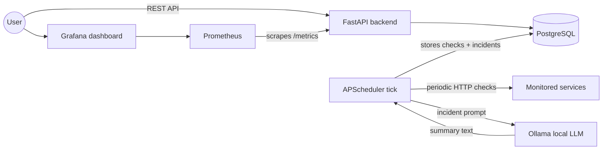

<div align="center">

# Centinela

**Local-first service monitoring with human-readable incident summaries.**

Centinela watches APIs, websites, and internal endpoints, stores their health history,
and will use a local LLM through Ollama to explain outages in plain language.

<p>
  <a href="https://github.com/JhomarSanchez/Centinela/actions/workflows/ci.yml"></a>
  
  
</p>

<p>
  
  
  
  
  
  
  
  
</p>

<p>
  <a href="#quick-start">Quick Start</a> ·
  <a href="#using-the-api">API</a> ·
  <a href="#how-health-checks-work">Health Checks</a> ·
  <a href="#dashboards-and-metrics">Dashboards</a> ·
  <a href="#ai-incident-summaries">AI Incidents</a> ·
  <a href="#run-on-kubernetes">Kubernetes</a> ·
  <a href="#running-the-tests">Tests</a> ·
  <a href="#architecture">Architecture</a> ·
  <a href="#roadmap">Roadmap</a>
</p>

</div>

---

## Why Centinela

Small services often fail quietly. A health endpoint starts timing out, a personal API goes down, or a dependency becomes flaky — and you only notice after checking manually.

Centinela answers the questions that matter first:

- **Is this service up right now?** Scheduled health checks record the latest state.
- **How has it behaved over time?** Every check is stored with status, latency, and HTTP code.
- **What happened when it failed?** A later phase adds AI incident summaries generated locally with Ollama.

It is not another giant observability platform — it is a focused, portfolio-grade monitoring system built in small, working phases.

## What Works Today

Every planned phase is implemented, tested, and verified:

| | Capability |
|---|---|
| 🩺 | **Health checks** — register any URL and a background scheduler probes it on its own interval. |
| 🗄️ | **History** — every result (`up`, `degraded`, `down`) lands in PostgreSQL, with automatic retention cleanup. |
| 📈 | **Dashboards** — Prometheus scrapes `/metrics`; a pre-provisioned Grafana dashboard shows status, availability %, latency, and open incidents with zero manual setup. |
| 🤖 | **AI incident summaries** — repeated failures open an *incident* and a local LLM (Ollama) explains it in plain language. No cloud APIs, everything stays on your machine. |
| 🐳 | **One-command startup** — the whole stack runs with `docker compose up`. |
| ☸️ | **Kubernetes-ready** — kustomize manifests deploy the same stack to a local cluster (kind/Minikube). |
| ✅ | **CI** — GitHub Actions lints, runs the 69-test suite, builds the image, and validates the manifests on every push. |
| 🔐 | **Guarded writes** — mutating endpoints require an `X-API-Key` header. |

## Quick Start

Requirements: [Docker](https://docs.docker.com/get-docker/) with Docker Compose.

```bash
# 1. Configure the environment (defaults work out of the box)
cp .env.example .env

# 2. Build and start the full stack (API, PostgreSQL, Prometheus, Grafana, Ollama)
docker compose up --build -d

# 3. Verify it is alive
curl http://localhost:8000/health
# {"status":"ok"}

# 4. One-time: download the local LLM used for incident summaries (~4.9 GB)
docker compose exec ollama ollama pull llama3.1:8b
```

> **No NVIDIA GPU?** Remove the `deploy:` block from the `ollama` service in
> `docker-compose.yml` (runs on CPU, slower), or set `OLLAMA_ENABLED=false` in
> `.env` to skip AI summaries entirely — incidents still work without them.

Once the stack is up:

| URL | What you get |
|---|---|
| <http://localhost:8000/docs> | Interactive API documentation (Swagger UI). |
| <http://localhost:8000/metrics> | Raw Prometheus metrics. |
| <http://localhost:9090> | Prometheus UI (queries and target status). |
| <http://localhost:3000> | Grafana — the **Centinela - Service Health** dashboard is pre-provisioned. Login: `admin` / your `GRAFANA_ADMIN_PASSWORD` (default `change-me`). |

Database migrations run automatically when the backend container starts.

## Using the API

Write operations require the API key from your `.env` (default: `change-me`).

```bash
# Register a service checked every 60 seconds
curl -X POST http://localhost:8000/services \
  -H "X-API-Key: change-me" \
  -H "Content-Type: application/json" \
  -d '{"name": "Personal API", "url": "https://example.com/health", "check_interval_seconds": 60}'

# List registered services (reads need no key)
curl http://localhost:8000/services

# Read the most recent checks, newest first
curl "http://localhost:8000/services/1/checks?limit=10"

# Change the check interval
curl -X PATCH http://localhost:8000/services/1 \
  -H "X-API-Key: change-me" \
  -H "Content-Type: application/json" \
  -d '{"check_interval_seconds": 30}'

# Stop monitoring (also deletes its check history and incidents)
curl -X DELETE http://localhost:8000/services/1 -H "X-API-Key: change-me"

# List incidents (all, only open, or per service)
curl http://localhost:8000/incidents
curl "http://localhost:8000/incidents?active=true"
curl http://localhost:8000/services/1/incidents
```

A check looks like this:

```json
{
  "id": 42,
  "service_id": 1,
  "checked_at": "2026-07-07T22:28:38.221244Z",
  "status": "up",
  "latency_ms": 228,
  "http_code": 200
}
```

## How Health Checks Work

A scheduler tick runs every few seconds (`SCHEDULER_TICK_SECONDS`), finds the services whose last check is older than their `check_interval_seconds`, performs an HTTP GET against each one, and stores the result:

| Result | Status |
|---|---|
| No response (timeout, DNS failure, connection refused) | `down` |
| HTTP 5xx | `down` |
| HTTP 4xx | `degraded` |
| HTTP 2xx/3xx slower than `DEGRADED_LATENCY_MS` | `degraded` |
| HTTP 2xx/3xx within the latency threshold | `up` |

All thresholds are configurable through environment variables — see [`.env.example`](./.env.example).

Checks older than `CHECK_RETENTION_DAYS` (default 30) are deleted once a day so the history table never grows without bound; incidents are kept forever.

## AI Incident Summaries

When a service fails `INCIDENT_FAILURE_THRESHOLD` consecutive checks (default 3), Centinela opens an **incident** and asks a local LLM (running in the Ollama container) to explain it in plain language:

```json
{
  "id": 1,
  "service_id": 4,
  "started_at": "2026-07-08T17:11:46Z",
  "resolved_at": null,
  "ai_summary": "The Broken service has been unreachable since 17:09 UTC. Every check fails without an HTTP response, which points to DNS or connectivity problems rather than an application error. Start by verifying the hostname resolves and the server is reachable from the network.",
  "raw_context": "You are the assistant of a service-monitoring system..."
}
```

Worth knowing:

- The incident **starts when the failure streak began**, not when the threshold was crossed.
- A successful check resolves the incident automatically (`resolved_at`).
- `degraded` results neither open nor resolve incidents — only real downs and real recoveries count.
- The AI is best-effort: if Ollama is off or the model is not downloaded, the incident opens with `ai_summary: null` and the summary is retried on later failed checks. `raw_context` always stores the exact prompt used, for transparency.
- Everything stays on your machine: no external AI APIs are involved.

## Dashboards and Metrics

Every stored check also updates Prometheus metrics, scraped from `GET /metrics` every 15 seconds:

| Metric | Type | Meaning |
|---|---|---|
| `centinela_service_status{service_name}` | gauge | Latest result: `0` down, `1` degraded, `2` up. |
| `centinela_service_up{service_name}` | gauge | `1` only when the latest check was `up` (degraded counts as not up). |
| `centinela_check_latency_seconds{service_name}` | gauge | Latency of the latest check. |
| `centinela_checks_total{service_name, status}` | counter | Checks performed since startup, by result. |
| `centinela_incident_open{service_name}` | gauge | `1` while the service has an unresolved incident. |
| `centinela_incidents_total{service_name}` | counter | Incidents opened since startup. |

The provisioned Grafana dashboard (**Centinela - Service Health**) shows the current status per service, availability over the selected time range, latency history, and check results over time. It lives in [`observability/grafana/dashboards/centinela.json`](./observability/grafana/dashboards/centinela.json), so dashboard changes are versioned like code.

On startup the backend restores the last known status of every service from the database, so restarting the stack never leaves the dashboard empty.

## Run on Kubernetes

The same stack deploys to a local Kubernetes cluster from the kustomize manifests in [`k8s/`](./k8s):

```bash
# 1. Create a local cluster (kind shown; Minikube works the same way)
kind create cluster --name centinela

# 2. Build the backend image and load the images into the cluster
docker build -t centinela-backend:0.3.0 ./backend
kind load docker-image centinela-backend:0.3.0 postgres:16-alpine \
  prom/prometheus:v3.5.0 grafana/grafana:12.0.2 ollama/ollama:latest \
  --name centinela

# 3. Deploy everything
kubectl apply -k k8s/overlays/local

# 4. Wait for the pods, then reach the API and Grafana with port-forwards
kubectl -n centinela rollout status deployment/backend
kubectl -n centinela port-forward svc/backend 8000:8000
kubectl -n centinela port-forward svc/grafana 3000:3000

# One-time: pull the LLM inside the cluster (or set OLLAMA_ENABLED=false)
kubectl -n centinela exec deploy/ollama -- ollama pull llama3.1:8b
```

`k8s/base/` defines the five components (Deployments, Services, PVCs, generated ConfigMaps and Secrets); `k8s/overlays/local/` shows the overlay pattern with local tweaks. The secret values are `change-me` placeholders — override them in an overlay for anything beyond a throwaway cluster. Tear everything down with `kind delete cluster --name centinela`.

## Running the Tests

Tests run against an in-memory SQLite database, so they need no containers and finish in under a second.

```bash
cd backend
python -m venv .venv && source .venv/bin/activate   # on Windows: .venv\Scripts\activate
pip install -r requirements-dev.txt
pytest -v
ruff check .
```

## Architecture

The backend keeps a layered structure (routes → services → models) with PostgreSQL and an in-process APScheduler. Prometheus scrapes the backend's `/metrics` and Grafana visualizes it. Ollama generates incident summaries over the internal network — it never touches the database and is never exposed outside the stack. The same topology ships as Docker Compose for daily use and as kustomize manifests for Kubernetes, and GitHub Actions validates every change.



See [`docs/ARCHITECTURE.md`](./docs/ARCHITECTURE.md) for the full design and decision context.

## Roadmap

| Phase | Scope | Status |
|---:|---|---|
| 0 | Planning, architecture, AI-agent context | ✅ Done |
| 1 | FastAPI backend, PostgreSQL, health checks, Docker Compose, tests | ✅ Done |
| 2 | Prometheus metrics and Grafana dashboards | ✅ Done |
| 3 | Incident detection and local AI summaries with Ollama | ✅ Done |
| 4 | Local Kubernetes deployment (kind/Minikube) | ✅ Done |
| 5 | CI with GitHub Actions | ✅ Done |

All planned phases are shipped. Candidate future work: email/Slack alerts on incidents, a real cloud deployment, multi-user auth, GitOps with Argo CD. Details in [`docs/ROADMAP.md`](./docs/ROADMAP.md).

## Repository Map

| Path | Purpose |
|---|---|
| [`backend/`](./backend) | FastAPI application, migrations, and tests. |
| [`observability/`](./observability) | Prometheus scrape config and Grafana provisioning + dashboards. |
| [`k8s/`](./k8s) | Kustomize manifests: base + local overlay for kind/Minikube. |
| [`.github/workflows/`](./.github/workflows) | CI pipeline: lint, tests, image build, manifest validation. |
| [`docker-compose.yml`](./docker-compose.yml) | Local stack: backend + PostgreSQL + Prometheus + Grafana + Ollama. |
| [`docs/ARCHITECTURE.md`](./docs/ARCHITECTURE.md) | System design and technical decisions. |
| [`docs/ROADMAP.md`](./docs/ROADMAP.md) | Phased delivery plan. |
| [`docs/DECISIONS_LOG.md`](./docs/DECISIONS_LOG.md) | Historical decision log. |
| [`AGENTS.md`](./AGENTS.md) | Primary instructions for AI coding agents. |
| [`CLAUDE.md`](./CLAUDE.md) | Claude Code-specific notes. |
| [`.env.example`](./.env.example) | Safe environment variable template. |

## License

Licensed under the [Apache License 2.0](./LICENSE).
