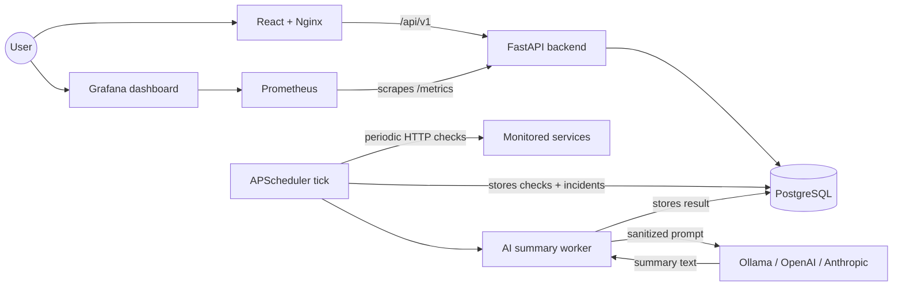

<div align="center">

# Centinela

**Local-first service monitoring with a real product UI and explainable incidents.**

Centinela watches APIs, websites, and internal endpoints, stores their health history,
and uses your choice of Ollama, OpenAI, or Anthropic to explain outages in plain language.

<p>
  <a href="https://github.com/JhomarSanchez/Centinela/actions/workflows/ci.yml"></a>
  
  
</p>

<p>
  
  
  
  
  
  
  
  
  
</p>

<p>
  <a href="#quick-start">Quick Start</a> ·
  <a href="#using-the-api">API</a> ·
  <a href="#how-health-checks-work">Health Checks</a> ·
  <a href="#dashboards-and-metrics">Dashboards</a> ·
  <a href="#ai-incident-summaries">AI Incidents</a> ·
  <a href="#run-on-kubernetes">Kubernetes</a> ·
  <a href="#running-the-tests">Tests</a> ·
  <a href="#architecture">Architecture</a> ·
  <a href="#roadmap">Roadmap</a>
</p>

</div>

---

## Why Centinela

Small services often fail quietly. A health endpoint starts timing out, a personal API goes down, or a dependency becomes flaky — and you only notice after checking manually.

Centinela answers the questions that matter first:

- **Is this service up right now?** Scheduled health checks record the latest state.
- **How has it behaved over time?** Every check is stored with status, latency, and HTTP code.
- **What happened when it failed?** Provider-neutral AI summaries explain the evidence and first investigation step.
- **Can a non-developer operate it?** The bilingual web app handles services, checks, incidents, and AI settings without curl.

It is not another giant observability platform — it is a focused, portfolio-grade monitoring system built in small, working phases.

## What Works Today

Every planned phase is implemented, tested, and verified:

| | Capability |
|---|---|
| 🩺 | **Health checks** — register any URL and a background scheduler probes it on its own interval. |
| 🗄️ | **History** — every result (`up`, `degraded`, `down`) lands in PostgreSQL, with automatic retention cleanup. |
| 🖥️ | **Product UI** — a responsive Spanish/English React app manages services, charts, incidents, themes, and AI configuration. |
| 📈 | **Technical dashboards** — Prometheus and a pre-provisioned Grafana dashboard remain available for deeper operational analysis. |
| 🤖 | **Provider-neutral AI summaries** — choose local Ollama or bring an OpenAI/Anthropic API key, encrypted at rest. |
| 🐳 | **One-command startup** — the whole stack runs with `docker compose up`. |
| ☸️ | **Kubernetes-ready** — kustomize manifests deploy the same stack to a local cluster (kind/Minikube). |
| ✅ | **CI** — GitHub Actions validates backend, frontend, generated API contracts, browser flows, images, and manifests. |
| 🔐 | **Guarded writes** — mutating endpoints require an `X-API-Key` header. |

## Quick Start

Requirements: [Docker](https://docs.docker.com/get-docker/) with Docker Compose.

```bash
# 1. Configure the local administrator and encryption secret
cp .env.example .env
# Edit API_KEY, then generate APP_SECRET_KEY with:
python -c "import secrets; print(secrets.token_urlsafe(48))"

# 2. Build and start the UI, API, PostgreSQL, Prometheus, and Grafana
docker compose up --build -d

# 3. Open http://localhost:8080 and sign in with API_KEY
# The backend remains available for CLI use:
curl http://localhost:8000/health
# {"status":"ok"}
```

Ollama is optional. To run it on CPU, set `OLLAMA_ENABLED=true`, select Ollama in
the web settings, and start its profile:

```bash
docker compose --profile ollama up -d
docker compose exec ollama ollama pull llama3.1:8b
```

For NVIDIA acceleration, add `-f docker-compose.gpu.yml` to the first command.
OpenAI and Anthropic need no extra container: paste the provider API key in the
web settings after changing `APP_SECRET_KEY` from its public default.

Once the stack is up:

| URL | What you get |
|---|---|
| <http://localhost:8080> | Centinela web application (Spanish/English). |
| <http://localhost:8000/docs> | Interactive API documentation (Swagger UI). |
| <http://localhost:8000/metrics> | Raw Prometheus metrics. |
| <http://localhost:9090> | Prometheus UI (queries and target status). |
| <http://localhost:3000> | Grafana — the **Centinela - Service Health** dashboard is pre-provisioned. Login: `admin` / your `GRAFANA_ADMIN_PASSWORD` (default `change-me`). |

Database migrations run automatically when the backend container starts.

## Using the API

Every data endpoint requires either the signed browser session or `X-API-Key`.
The versioned `/api/v1` contract is preferred; unversioned paths are temporary
authenticated compatibility aliases.

```bash
# Register a service checked every 60 seconds
curl -X POST http://localhost:8000/api/v1/services \
  -H "X-API-Key: change-me" \
  -H "Content-Type: application/json" \
  -d '{"name": "Personal API", "url": "https://example.com/health", "check_interval_seconds": 60}'

# List registered services (reads need no key)
curl http://localhost:8000/api/v1/services -H "X-API-Key: change-me"

# Read the most recent checks, newest first
curl "http://localhost:8000/api/v1/services/1/checks?limit=10" -H "X-API-Key: change-me"

# Change the check interval
curl -X PATCH http://localhost:8000/api/v1/services/1 \
  -H "X-API-Key: change-me" \
  -H "Content-Type: application/json" \
  -d '{"check_interval_seconds": 30}'

# Stop monitoring (also deletes its check history and incidents)
curl -X DELETE http://localhost:8000/api/v1/services/1 -H "X-API-Key: change-me"

# List incidents (all, only open, or per service)
curl http://localhost:8000/api/v1/incidents -H "X-API-Key: change-me"
curl "http://localhost:8000/api/v1/incidents?active=true" -H "X-API-Key: change-me"
curl -X POST http://localhost:8000/api/v1/services/1/checks/run -H "X-API-Key: change-me"
```

A check looks like this:

```json
{
  "id": 42,
  "service_id": 1,
  "checked_at": "2026-07-07T22:28:38.221244Z",
  "status": "up",
  "latency_ms": 228,
  "http_code": 200
}
```

## How Health Checks Work

A scheduler tick runs every few seconds (`SCHEDULER_TICK_SECONDS`), finds the services whose last check is older than their `check_interval_seconds`, performs an HTTP GET against each one, and stores the result:

| Result | Status |
|---|---|
| No response (timeout, DNS failure, connection refused) | `down` |
| HTTP 5xx | `down` |
| HTTP 4xx | `degraded` |
| HTTP 2xx/3xx slower than `DEGRADED_LATENCY_MS` | `degraded` |
| HTTP 2xx/3xx within the latency threshold | `up` |

All thresholds are configurable through environment variables — see [`.env.example`](./.env.example).

Checks older than `CHECK_RETENTION_DAYS` (default 30) are deleted once a day so the history table never grows without bound; incidents are kept forever.

## AI Incident Summaries

When a service fails `INCIDENT_FAILURE_THRESHOLD` consecutive checks (default 3),
Centinela opens an **incident** and queues a summary with the globally selected
provider: Ollama, OpenAI Responses API, or Anthropic Messages API.

```json
{
  "id": 1,
  "service_id": 4,
  "started_at": "2026-07-08T17:11:46Z",
  "resolved_at": null,
  "ai_provider": "openai",
  "ai_model": "your-selected-model",
  "ai_status": "completed",
  "ai_summary": "The Broken service has been unreachable since 17:09 UTC. Every check fails without an HTTP response, which points to DNS or connectivity problems rather than an application error. Start by verifying the hostname resolves and the server is reachable from the network.",
  "ai_attempt_count": 1
}
```

Worth knowing:

- The incident **starts when the failure streak began**, not when the threshold was crossed.
- A successful check resolves the incident automatically (`resolved_at`).
- `degraded` results neither open nor resolve incidents — only real downs and real recoveries count.
- AI is best-effort and independent from health checks. Provider calls run in a
  separate worker, retry after 1 and 5 minutes, then wait for a manual retry.
- URLs sent to cloud models have credentials, query parameters, and fragments
  removed. The exact prompt is available only from the authenticated context endpoint.
- Provider credentials are encrypted with a key derived from `APP_SECRET_KEY`;
  the API and UI only expose whether a key exists and its final four characters.
- Ollama keeps data local. Selecting OpenAI or Anthropic explicitly sends the
  sanitized incident facts to that provider and uses its separate API billing.

## Dashboards and Metrics

Every stored check also updates Prometheus metrics, scraped from `GET /metrics` every 15 seconds:

| Metric | Type | Meaning |
|---|---|---|
| `centinela_service_status{service_name}` | gauge | Latest result: `0` down, `1` degraded, `2` up. |
| `centinela_service_up{service_name}` | gauge | `1` only when the latest check was `up` (degraded counts as not up). |
| `centinela_check_latency_seconds{service_name}` | gauge | Latency of the latest check. |
| `centinela_checks_total{service_name, status}` | counter | Checks performed since startup, by result. |
| `centinela_incident_open{service_name}` | gauge | `1` while the service has an unresolved incident. |
| `centinela_incidents_total{service_name}` | counter | Incidents opened since startup. |

The provisioned Grafana dashboard (**Centinela - Service Health**) shows the current status per service, availability over the selected time range, latency history, and check results over time. It lives in [`observability/grafana/dashboards/centinela.json`](./observability/grafana/dashboards/centinela.json), so dashboard changes are versioned like code.

On startup the backend restores the last known status of every service from the database, so restarting the stack never leaves the dashboard empty.

## Run on Kubernetes

The same stack deploys to a local Kubernetes cluster from the kustomize manifests in [`k8s/`](./k8s):

```bash
# 1. Create a local cluster (kind shown; Minikube works the same way)
kind create cluster --name centinela

# 2. Build and load the application images
docker build -t centinela-backend:0.6.0 ./backend
docker build -t centinela-frontend:0.6.0 ./frontend
kind load docker-image centinela-backend:0.6.0 centinela-frontend:0.6.0 \
  postgres:16-alpine prom/prometheus:v3.5.0 grafana/grafana:12.0.2 \
  --name centinela

# 3. Deploy everything
kubectl apply -k k8s/overlays/local

# 4. Wait for the pods, then open the product UI
kubectl -n centinela rollout status deployment/backend
kubectl -n centinela port-forward svc/frontend 8080:8080
```

The base works without a local LLM. To include Ollama, load its image and apply
`k8s/overlays/local-ollama`; then pull the model inside the pod. Secret values are
local placeholders—replace `API_KEY`, `APP_SECRET_KEY`, and database/Grafana
passwords before using a shared cluster.

## Running the Tests

Backend tests use in-memory SQLite and mocked providers. Frontend unit tests use
jsdom, while the Playwright acceptance test starts a disposable SQLite API and a
real Chromium browser; no live cloud model is called.

```bash
cd backend
python -m venv .venv && source .venv/bin/activate   # on Windows: .venv\Scripts\activate
pip install -r requirements-dev.txt
pytest -v
ruff check .

cd ../frontend
npm ci
npm run lint
npm run test
npm run build
npx playwright install chromium  # one-time browser install
npm run e2e
```

## Architecture

The React application calls the versioned FastAPI API through a same-origin Nginx
proxy. FastAPI stores data in PostgreSQL and schedules health checks. A separate
scheduler job processes AI summaries so slow providers cannot delay monitoring.
Prometheus and Grafana remain an independent technical observability path.



See [`docs/ARCHITECTURE.md`](./docs/ARCHITECTURE.md) for the full design and decision context.

## Roadmap

| Phase | Scope | Status |
|---:|---|---|
| 0 | Planning, architecture, AI-agent context | ✅ Done |
| 1 | FastAPI backend, PostgreSQL, health checks, Docker Compose, tests | ✅ Done |
| 2 | Prometheus metrics and Grafana dashboards | ✅ Done |
| 3 | Incident detection and local AI summaries with Ollama | ✅ Done |
| 4 | Local Kubernetes deployment (kind/Minikube) | ✅ Done |
| 5 | CI with GitHub Actions | ✅ Done |
| 6 | Product UI, secure sessions, and multi-provider AI | ✅ Done |

Next recommended phases are alerting and incident workflow, advanced monitor
types, then cloud/multi-user hardening. Details live in [`docs/ROADMAP.md`](./docs/ROADMAP.md).

## Repository Map

| Path | Purpose |
|---|---|
| [`backend/`](./backend) | FastAPI application, migrations, and tests. |
| [`frontend/`](./frontend) | React/TypeScript product UI, generated API types, and browser tests. |
| [`observability/`](./observability) | Prometheus scrape config and Grafana provisioning + dashboards. |
| [`k8s/`](./k8s) | Kustomize manifests: base + local overlay for kind/Minikube. |
| [`.github/workflows/`](./.github/workflows) | CI pipeline: lint, tests, image build, manifest validation. |
| [`docker-compose.yml`](./docker-compose.yml) | Local UI/API/data/observability stack; Ollama is an optional profile. |
| [`docs/ARCHITECTURE.md`](./docs/ARCHITECTURE.md) | System design and technical decisions. |
| [`docs/ROADMAP.md`](./docs/ROADMAP.md) | Phased delivery plan. |
| [`docs/DECISIONS_LOG.md`](./docs/DECISIONS_LOG.md) | Historical decision log. |
| [`AGENTS.md`](./AGENTS.md) | Primary instructions for AI coding agents. |
| [`CLAUDE.md`](./CLAUDE.md) | Claude Code-specific notes. |
| [`.env.example`](./.env.example) | Safe environment variable template. |

## License

Licensed under the [Apache License 2.0](./LICENSE).
