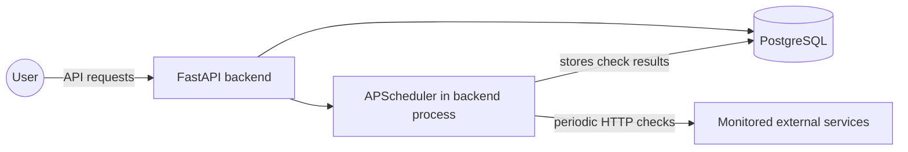
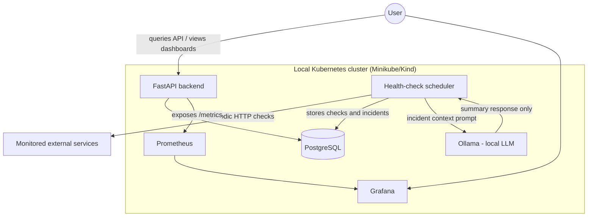

# ARCHITECTURE.md

## Context and Goal

Centinela is a monitoring platform for personal use and as a portfolio project. The goal is to help the author monitor personal services and demonstrate backend, DevOps, observability, and local AI integration skills.

The system is not designed for massive scale or multi-tenant production use. It should run well on one machine or a local cluster while still following production-minded practices such as containers, observability, and CI.

## Phase 1 Architecture

Phase 1 should stay intentionally small:

- A FastAPI backend exposes service-management endpoints.
- PostgreSQL stores services and health-check history.
- APScheduler runs inside the backend process and checks registered services periodically.
- Docker Compose runs the backend and PostgreSQL locally.

This keeps the first implementation easy to understand. A separate worker process can be introduced later only if the scheduler becomes too complex for the backend process.

## Target Architecture

Later phases add observability, local AI incident summaries, and Kubernetes deployment.

Ollama does not write to the database. The backend or scheduler sends a prompt to Ollama, receives a summary, and stores that summary in PostgreSQL.

## Draft Data Model

**Service**

- `id`
- `name`
- `url`
- `check_interval_seconds`
- `created_at`

**Check** - historical record of each health check

- `id`
- `service_id`
- `timestamp`
- `status` (`up`, `down`, or `degraded`)
- `latency_ms`
- `http_code`

**Incident**

- `id`
- `service_id`
- `started_at`
- `resolved_at` (nullable)
- `ai_summary` (text generated by Ollama)
- `raw_context` (checks and metadata used to generate the summary)

## Incident Detection Flow

1. The scheduler checks each service based on `check_interval_seconds`.
2. If a service fails N consecutive times, using a configurable threshold such as 3, the system creates an `Incident`.
3. The backend or scheduler builds a prompt with the service name, recent checks, status, latency, HTTP code, and incident start time.
4. The prompt is sent to Ollama over the internal service network.
5. Ollama returns a short incident summary.
6. The backend or scheduler stores the summary on the `Incident`.
7. When the service responds successfully again, the system sets `resolved_at`.

## Key Decisions and Alternatives

| Decision | Alternative Considered | Reason |
|---|---|---|
| FastAPI | Flask, Django | Native async support, Pydantic typing, and a strong ecosystem for services that integrate with AI. |
| PostgreSQL first | TimescaleDB from the start | PostgreSQL is enough for a portfolio MVP; TimescaleDB can be added later if time-series volume justifies it. |
| Ollama local | OpenAI or Anthropic API | Local AI keeps data on the machine, avoids paid external APIs, and demonstrates self-hosted AI skills. |
| Grafana instead of a custom dashboard | Custom frontend dashboard | Grafana saves frontend time and is an industry-standard observability tool. |
| Local Kubernetes | Cloud deployment from the start | Minikube or Kind avoids cloud cost while still teaching Kubernetes concepts. |

## Basic Security

- The API should require a simple API key in the `X-API-Key` header for write operations.
- Secrets such as database passwords must live in environment variables, not in source code.
- `.env` is ignored by git; `.env.example` contains only safe placeholders.
- Ollama should only be reachable inside the container or cluster network, not exposed publicly.

## Out of Scope for Now

- Multi-user authentication.
- Email or Slack alerts.
- Real cloud deployment.
