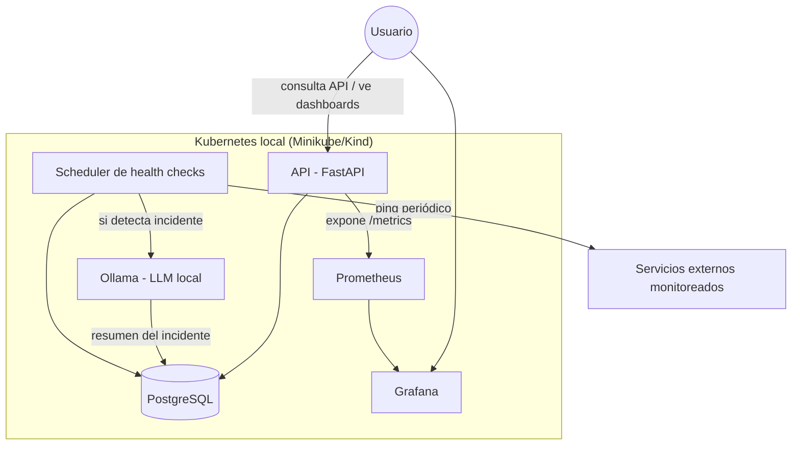

# ARCHITECTURE.md

## Contexto y objetivo

Centinela es una plataforma de monitoreo para uso personal y como pieza de portafolio. El objetivo es que el propio autor pueda monitorear sus servicios/proyectos, y de paso, demostrar competencias de backend + DevOps + integración de IA local.

No está diseñada para escala masiva ni multi-tenant; está pensada para correr bien en una sola máquina/clúster local, con buenas prácticas de producción (contenedores, observabilidad, CI) aunque el volumen de datos sea modesto.

## Componentes

## Modelo de datos (borrador)

**Service**
- `id`, `name`, `url`, `check_interval_seconds`, `created_at`

**Check** (histórico de cada revisión)
- `id`, `service_id`, `timestamp`, `status` (`up` / `down` / `degraded`), `latency_ms`, `http_code`

**Incident**
- `id`, `service_id`, `started_at`, `resolved_at` (nullable), `ai_summary` (texto generado por Ollama), `raw_context` (checks usados para generar el resumen)

## Flujo de detección de incidentes

1. El scheduler revisa cada servicio según su `check_interval_seconds`.
2. Si un servicio falla N veces seguidas (umbral configurable, ej. 3), se crea un `Incident`.
3. Se arma un prompt con: nombre del servicio, últimos N checks (status, latencia, código HTTP), hora de inicio.
4. Se envía ese prompt a Ollama (corriendo local, con GPU) pidiendo un resumen breve del incidente.
5. El resumen se guarda en el `Incident` y queda disponible vía API y, más adelante, como anotación en Grafana.
6. Cuando el servicio vuelve a responder OK, se marca `resolved_at`.

## Decisiones clave y alternativas consideradas

| Decisión | Alternativa considerada | Por qué se eligió esta opción |
|---|---|---|
| FastAPI | Flask, Django | Async nativo, tipado con Pydantic, buen ecosistema para servicios que hablan con IA |
| PostgreSQL simple | TimescaleDB desde el inicio | Para un MVP de portafolio, Postgres es suficiente; se puede migrar a Timescale después si el volumen de datos lo justifica |
| Ollama local | API de OpenAI/Anthropic | Privacidad (los datos no salen de tu máquina), costo cero, y es en sí mismo una habilidad de portafolio (self-hosting de IA) |
| Grafana en vez de dashboard propio | Dashboard custom | Ahorra tiempo de frontend, es un estándar de la industria que los reclutadores reconocen |
| Kubernetes local (Minikube/Kind) | Cloud real (AWS/GCP) desde el inicio | Sin costo, y el aprendizaje de K8s es equivalente; se puede migrar a cloud como fase futura opcional |

## Seguridad (nivel básico, apropiado para este alcance)

- La API requiere una API key simple en un header (`X-API-Key`) para operaciones de escritura.
- Secretos (contraseñas de DB, etc.) solo en variables de entorno, nunca en el código.
- Ollama solo accesible dentro de la red interna del clúster, no expuesto públicamente.

## Fuera de alcance (por ahora)

- Autenticación multi-usuario.
- Alertas por email/Slack (posible fase futura).
- Despliegue en cloud real (posible fase futura, ver `ROADMAP.md`).
