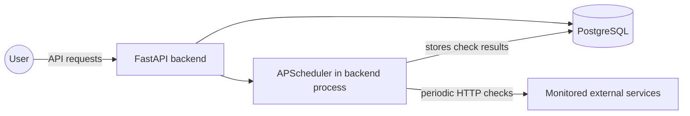
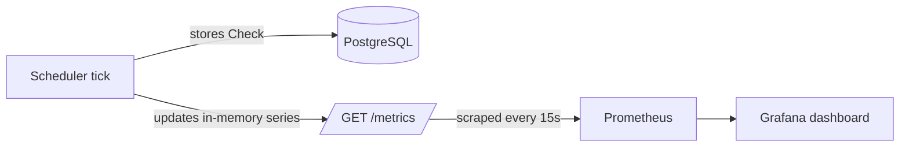
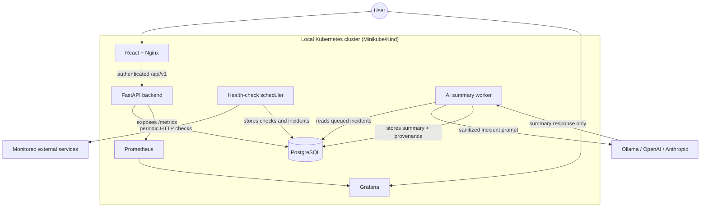

# ARCHITECTURE.md

## Context and Goal

Centinela is a monitoring platform for personal use and as a portfolio project. The goal is to help the author monitor personal services and demonstrate backend, DevOps, observability, and local AI integration skills.

The system is not designed for massive scale or multi-tenant production use. It should run well on one machine or a local cluster while still following production-minded practices such as containers, authenticated product flows, observability, and CI.

## Phase 1 Architecture

Phase 1 should stay intentionally small:

- A FastAPI backend exposes service-management endpoints.
- PostgreSQL stores services and health-check history.
- APScheduler runs inside the backend process and checks registered services periodically.
- Docker Compose runs the backend and PostgreSQL locally.

This keeps the first implementation easy to understand. A separate worker process can be introduced later only if the scheduler becomes too complex for the backend process.

## Phase 2 Architecture (implemented)

Phase 2 adds classic observability on top of Phase 1, still in Docker Compose:

- The backend exposes Prometheus metrics at `GET /metrics` (no API key; it only reveals service names and statuses).
- Every health check updates in-memory metric series: latest status per service (`centinela_service_status`), a 0/1 availability gauge (`centinela_service_up`), latest latency in seconds (`centinela_check_latency_seconds`), and a cumulative counter by result (`centinela_checks_total`).
- On startup the backend re-seeds the gauges from the newest stored check per service, so restarts do not blank the dashboard. Deleting or renaming a service drops/moves its series.
- Prometheus scrapes the backend every 15 seconds.
- Grafana is provisioned from files under `observability/grafana/`: the Prometheus datasource and a "Centinela - Service Health" dashboard (current status, availability %, latency history, checks by result) exist immediately after `docker compose up`.

## Phase 3 Architecture (implemented)

This section records the original Phase 3 design. Phase 6 supersedes its
Ollama-only transport and retry behavior while preserving incident semantics.

Phase 3 adds incident tracking and local AI summaries:

- Ollama runs as a separate Compose service with no published ports: only the backend can reach it over the internal network. Models persist in the `ollama_models` volume (`docker compose exec ollama ollama pull llama3.1:8b` is a one-time step).
- After each stored check, the scheduler runs incident logic: `INCIDENT_FAILURE_THRESHOLD` (default 3) consecutive `down` checks open an `Incident`; an `up` check resolves it; `degraded` does neither (it breaks a down-streak but is not a recovery).
- When an incident opens, the backend builds a prompt from real data (service name, URL, incident start, last 10 checks) and asks Ollama for a 3-4 sentence summary. The prompt is stored on the incident (`raw_context`) for transparency.
- The AI is strictly best-effort: if Ollama is disabled, unreachable, or the model is not pulled yet, the incident still opens with `ai_summary = NULL`, and each later `down` check retries the summary. Incident bookkeeping never depends on the LLM.
- Incidents are exposed at `GET /incidents` (filter `?active=true|false`) and `GET /services/{id}/incidents`, and on the dashboard via the `centinela_incident_open` and `centinela_incidents_total` metrics.

## Phase 4-5 Architecture (implemented)

The full stack also runs in a local Kubernetes cluster (tested with kind), defined as kustomize manifests under `k8s/`:

- `k8s/base/` holds Deployments, Services, and PersistentVolumeClaims for the five components, plus generated ConfigMaps (shared settings, Prometheus scrape config, Grafana provisioning) and a Secret with `change-me` placeholders for local use.
- `k8s/overlays/local/` shows the kustomize overlay pattern: it reuses the base and merges a faster scheduler tick for demos. Real deployments would override the secrets here.
- Service DNS names match the Compose service names (`postgres`, `backend`, `ollama`, `prometheus`), so the Prometheus and Grafana configs are shared between both environments verbatim.
- The backend runs a single replica on purpose: the scheduler lives inside the API process, and two replicas would duplicate every health check. Splitting the scheduler into its own Deployment is the known path if scaling is ever needed.
- CI (GitHub Actions, `.github/workflows/ci.yml`) lints, tests, builds the Docker image, and renders both kustomize overlays on every push and pull request.

## Phase 6 Architecture (implemented)

Phase 6 adds a product surface and provider-neutral incident intelligence:

- A React/TypeScript SPA runs in its own Nginx container. Nginx serves the UI and proxies `/api/v1` to FastAPI, keeping browser cookies and CSRF checks on one origin.
- `API_KEY` remains the CLI credential and can be exchanged for a 12-hour signed admin session. Data endpoints require either form of authentication.
- The backend stores one global AI configuration. OpenAI and Anthropic keys are encrypted from `APP_SECRET_KEY`; responses expose only configured/not-configured state and a four-character hint.
- Ollama, OpenAI Responses API, and Anthropic Messages API implement one generation contract. Provider/model/latency/token provenance is stored on every completed summary.
- Incident creation only queues work. A separate APScheduler job processes summaries with bounded retries, so provider latency never blocks health-check ticks.
- The prompt removes URL credentials, query strings, and fragments before cloud use. Raw prompts are excluded from normal incident responses.
- Ollama is optional: the base Compose/Kubernetes stack works with no local model, while dedicated profiles/overlays add it when wanted.

## Current Architecture

AI providers never write to the database. The backend worker sends a sanitized prompt, receives text, and stores the result and provenance in PostgreSQL.

## Core Data Model

**Service**

- `id`
- `name`
- `url`
- `check_interval_seconds`
- `created_at`

**Check** - historical record of each health check

- `id`
- `service_id`
- `checked_at`
- `status` (`up`, `down`, or `degraded`)
- `latency_ms` (nullable)
- `http_code` (nullable; empty when no response was received at all)

**Incident**

- `id`
- `service_id`
- `started_at`
- `resolved_at` (nullable)
- `ai_summary` (text generated by the selected provider)
- `raw_context` (checks and metadata used to generate the summary)
- AI job status, provider/model provenance, attempts, timing, and token usage

**AISetting** - singleton global provider configuration

- provider, model, summary language, enabled state
- encrypted API key and non-sensitive four-character hint
- updated timestamp

## Incident Detection Flow

1. The scheduler checks each service based on `check_interval_seconds`.
2. If a service fails N consecutive times, using a configurable threshold such as 3, the system creates an `Incident`.
3. The backend or scheduler builds a prompt with the service name, recent checks, status, latency, HTTP code, and incident start time.
4. The incident is queued for the independent AI worker.
5. The worker sends the sanitized prompt to the configured Ollama, OpenAI, or Anthropic adapter.
6. The backend or scheduler stores the summary on the `Incident`.
7. When the service responds successfully again, the system sets `resolved_at`.

## Key Decisions and Alternatives

| Decision | Alternative Considered | Reason |
|---|---|---|
| FastAPI | Flask, Django | Native async support, Pydantic typing, and a strong ecosystem for services that integrate with AI. |
| PostgreSQL first | TimescaleDB from the start | PostgreSQL is enough for a portfolio MVP; TimescaleDB can be added later if time-series volume justifies it. |
| Provider abstraction with Ollama default | Ollama-only client, LiteLLM gateway | Explicit adapters keep local privacy while allowing BYOK cloud models without a large gateway dependency. |
| React product UI alongside Grafana | Grafana-only operation | The product UI owns CRUD, onboarding, incidents, and settings; Grafana remains the technical metrics surface. |
| Local Kubernetes | Cloud deployment from the start | Minikube or Kind avoids cloud cost while still teaching Kubernetes concepts. |

## Basic Security

- Data APIs require either `X-API-Key` or a signed admin session; session mutations also require CSRF proof.
- Secrets such as database passwords must live in environment variables, not in source code.
- `.env` is ignored by git; `.env.example` contains only safe placeholders.
- Ollama should only be reachable inside the container or cluster network, not exposed publicly.
- Cloud credentials are encrypted at rest and never returned to the browser or logs.

## Out of Scope for Now

- Multi-user authentication.
- Email or Slack alerts.
- Real cloud deployment.
- Provider fallback chains, per-service providers, and generic OpenAI-compatible endpoints.
